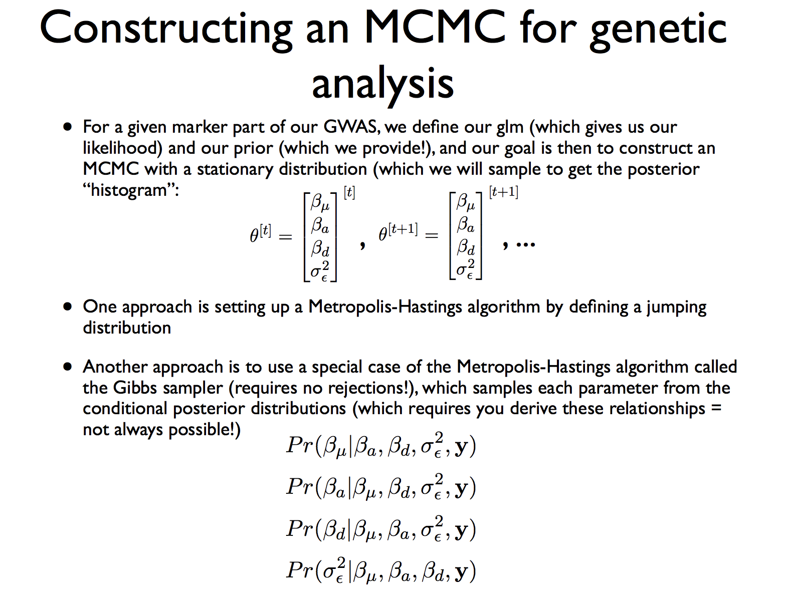

1. Bayesian Inference with Markov Chain Monte Carlo Methods

2. Example in Linear Regression

3. Calculating the Priors, Likelihoods, and Posteriors

4. Metropolis Hastings Algorithm


## 1. Bayesian Inference with Markov Chain Monte Carlo Methods

So far we have been dealing with parameter estimates that gave us an answer in the form of fixed numbers. For example, with the maximum likelihood estimators for $\theta = [\beta_{\mu}, \beta_a,\beta_d]$, we got fixed values for each parameter that we were interested in. In other words, we assumed that there are fixed true values of the parameters and used the estimaters that maximized the likelihood as our best guesses.

$$ L(\theta | data) \propto p(data | \theta) $$ 

$$ MLE(\hat{\theta}) = argmax_{\theta}(L(\theta | data)) $$  

The major difference between this and bayesian inference is that in bayesian inference we assume that there is a underlying "distribution" for our parameters not a single number. In order to estimate this distribution from a given sample, Bayes' theorem is used. 

$$ p(A | B) = \frac{p(B | A ) p (A)}{p(B)} $$

When we substitute A with $\theta$ and B with the data we get our bayesian formulation for the posterior distribution of the parameters given the observed data. 

$$ p(\theta| data) = \frac{p(data | \theta ) p (\theta)}{p(data)} $$

$p(data | \theta)$ is the likelihood and $p(data)$ is the probability of producing the data given all possible $\theta$ values , which is used as a normalizing constant and generally is difficult to calculate. $p(\theta)$ is the called the prior, and represents our belief (or initial guess) of how the parameters' distribution. The expression can be simplified by ignoring the constant part as:

$$ p(\theta| data) \propto L(\theta | data ) \cdot p (\theta) $$

### Bag of Marbles Example


While we can form this sum if the possible thetas are a trivial set.  For example, a classic Bayesian problem is that there are two bags of marbles, the first has 3 red and 4 blue, the second has 5 blue and 3 red.  If a red marble is drawn, what is the probability it came from the first bag?  Here the denominator would be the sum of two possible thetas, either bag 1 or bag 2.  Assuming the prior for choosing the bag is proportional to the number of marbles in the bag, the math for this problem follows:

$$ P(bag_1 | red) = \frac{P(red | bag_1)P(bag_1)}{\sum P(red | bag_i)} = \frac{(3/7)(7/15)}{(3/7)(7/15) + (3/8)(8/15)} $$

However, in real life scenarios there are not just two bags but rather likely thousands in the discrete case or an infinite number in the continous case.  This continous case will require an integral.  If the combination of the likelihood and prior are complicated it is likely that this integral will become intractable, meaning we cannot solve it.  

However, there is another way around this problem.  Instead of calculating this posterior probability directly we will simply pull single values from it and produce an empirical histogram of the distribution, thereby aproximating the true distribution.  With this approximated distribution we can continue with any hypothesis testing/ credible interval building that we want to do.


### Markov Chain Monte Carlo

The objective of Bayesian inference is to estimate the distribution of $\theta$ given the data. In other words, we are updating our belief about the parameters given the observed data as evidence. However, as you can see it takes a very complicated form which makes evaluating the posterior distribution a complicated problem. This is why we use methods like the Markov Chain Monte Carlo (MCMC) to generate "samples" that will represent the posterior distribution. The Metropolis-Hastings alogrithm is a widely used algorithm for this purpose. 

The intuition behind this is as follows:

+ Although it is difficult to figure out the shape of the whole distribution, we can calculate point densities for the posterior distribution by setting a value for $\theta$.

+ You can generate point densities by using random $\theta$ values that "jump around", and accept the value (keep as a sample) depending on how likely the density is compared to the previous $\theta$'s density. Simply put, $\theta$ values that have a relatively high likelihood are going to be sampled a lot, and the ones with a relatively low likelihood will be discarded most of the times.

+ Generate enough samples, and it will resemble the posterior distribution.

**Resources**

-MCMC example for determining whether or not a population is within Hardy-Weinberg Equilibrium: https://stephens999.github.io/fiveMinuteStats/MH-examples1.html
-A great introduction to Markov Chains, Monte Carlo methods, and the Metropolis-Hastings algorithm we implement below, check out this resource: https://blog.stata.com/2016/11/15/introduction-to-bayesian-statistics-part-2-mcmc-and-the-metropolis-hastings-algorithm/


## 2. Example in Linear Regression

First we are going to create a few data points with random values of Xa and using the parameters $\beta_{\mu} = 1.15, \beta_a = 3.5, \sigma = 2$. All the values are completely arbitrary so you are welcome to try it with different ones.

```{r data_generation, comment=NA, fig.align='center'}

set.seed(2018) #setting seed for reproducible results

# Generate linear regression sample
# creating Xa values (continuous)
Xa <- runif(100,min=-5,max = 5)

# True parameter values that we assume that we don't know before the analysis.
beta.mu <- 1.15
beta.a <- 3.5
sd <- 2

# Simulate Y based on the parameters
Y <- beta.mu + Xa * beta.a + rnorm(100,0,sd)

# A visual check of the data is always a good practice to inlcude
plot(Xa,Y, main="Xa vs Y")

```

So far everything seems familiar to us. We will use this example for demonstrating MCMC in subsequent sections. For the rest of this section, we'll discuss the priors we're choosing for this example.


## 3. Calculating the Priors, Likelihoods, and Posteriors

For the sake of simplicity we chose a standard normal prior on $\beta_{\mu},\beta_a$ and an exponential prior on $\sigma_{epsilon}$. For the algorithm we only need the point densities of the parameters, so I am using `dnorm` and `dexp`. 

**Question 1**

+ Why is a different prior more suitable for the standard deviation?

So it is always positive

Below we define a function for obtaining these priors. Since we usually deal with log likelihoods we also converted the densities to log scale by giving them the option `log = TRUE`. The reason for using log densities in this case is because if we use the densities as they are it often happens that the numbers are getting too small and thus getting subject to numerical errors.

```{r log.prior, comment=NA, fig.align='center'}
log.prior <- function(parameters){
  beta.mu <- parameters[1]
  beta.a <- parameters[2]
  sd <- parameters[3]
  
  mu.prior <- dnorm(beta.mu, log = TRUE)  # normal prior on beta.mu (mean 0, sd = 1)
  a.prior <- dnorm(beta.a, log = TRUE)    # normal prior on beta.a (mean 0, sd = 1)
  sdprior <- dexp(sd, log = TRUE)          # exponentional prior on sd
  return(mu.prior+a.prior+sdprior)
}
```


We also need to calculate the likelihood in order to get to the posterior. Below we wrote a function to calculate the expected Y values to determine and output the likelihood of our data given the parameters.

```{r log.likelihood}
log.likelihood <- function(parameters,Xa,Y){
    beta.mu <- parameters[1]
    beta.a <- parameters[2]
    sd <- parameters[3]
     
    y.hat <- beta.mu + Xa * beta.a
    likelihood <- dnorm(Y, mean = y.hat, sd = sd, log = TRUE)
    sum.likelihood <- sum(likelihood)
    return(sum.likelihood)   
}
```

Now that we have the likelihood and the prior, we can easily get the posterior through a simple function that sums up the log likelihood and the priors. 

```{r posterior, comment = NA}
log.posterior <- function(parameters, Xa,Y){
   posterior <- log.likelihood(parameters,Xa,Y) + log.prior(parameters)
   return (posterior)
}
```

With these simple helper-functions defined, we can go over the general format of the **Metropolis Hastings** algorithm.


## 4. Metropolis Hastings Algorithm

This example comes from https://theoreticalecology.wordpress.com/2010/09/17/metropolis-hastings-mcmc-in-r/

Recall from lecture the general format for the algorithm.

```{r, comment=F, echo=F, out.width = "400px", fig.show='hold',  fig.width=14, fig.height=14, fig.align='center'}

```

Below we provided some pseudocode for the algorithm:

```{r MCMC_pseudo, eval=FALSE}
# log.prior function defined above

# log.likelihood function defined above

# log.posterior function defined above

# proposal_func <- function() defined below

# Main algorithm
MH_MCMC <- function(startvalue, iterations,Xa,Y){
  
  # initialize variables
  #   to store parameters at each iteration
  #   to input starting values at first iteration spot
  samples <- 
  
  for (i in 1:iterations){
    
    # propose new parameters
    
    # get probability of new parameters
    
    unif <- runif(1)
    if (unif < probabilty){
      # update with new params if a high probability
    }else{
      # do not update (use last iteration params) if a low probability
    }
  }
  return(samples)
}

initial.value <- c(0,0,0)   # set strarting values

samples1 <- MH_MCMC(initial.value, 10000,Xa,Y) # Run the MH algorithm with 10000 iterations
 
burnIn = 1000  # discard the first 1000 iterations 

print( samples1[nrow(samples1),] )
```


The proposal function  takes care of the part where we "jump" around in the $\theta$ space. It is simply picking a value from a normal distribution centered around the current parameter values (although keeping the sd positive by taking the absolute value).

```{r proposal, comment = NA, fig.align='center'}
proposal_func <- function(parameters){
    proposal.output <- rnorm(3,mean = parameters, sd = c(0.2,0.2,0.2)) # why do we need an abs for the sd?
    proposal.output[3] <- abs(proposal.output[3])
    return(proposal.output) 
}
```

We have everything we need to run the **Metropolis-Hastings** algorithm, so let's give it a try by running the following code section. 

```{r MCMC, comment = NA, fig.align='center'}
MH_MCMC <- function(startvalue, iterations,Xa,Y){
    samples <- matrix(nrow = iterations+1, ncol = 3)
    samples[1,] <- startvalue
    for (i in 1:iterations){
      
        proposal <- proposal_func(samples[i,])
        
        probabilty <- exp(log.posterior(proposal,Xa,Y) - log.posterior(samples[i,],Xa,Y))
        
        unif <- runif(1)
        if (unif < probabilty){
            samples[i+1,] <- proposal     # update with a high probability
        }else{ 
            samples[i+1,] <- samples[i,]  # Do not update with a low probability
        }
    }
    return(samples)
}
 

initial.value <- c(0,0,0)   # set strarting values

samples1 <- MH_MCMC(initial.value, 10000,Xa,Y) # Run the MH algorithm with 10000 iterations
 
burnIn = 1000  # discard the first 1000 iterations 

print( samples1[nrow(samples1),] )

# Plot the results
par(mfrow = c(2,3))
hist(samples1[-(1:burnIn),1], main="Posterior of beta.mu", xlab="True value = red line" )
abline(v = mean(samples1[-(1:burnIn),1]))
abline(v = beta.mu, col="red" )
hist(samples1[-(1:burnIn),2], main="Posterior of beta.a", xlab="True value = red line")
abline(v = mean(samples1[-(1:burnIn),2]))
abline(v = beta.a, col="red" )
hist(samples1[-(1:burnIn),3], main="Posterior of sd", xlab="True value = red line")
abline(v = mean(samples1[-(1:burnIn),3]) )
abline(v = sd, col="red" )
plot(samples1[-(1:burnIn),1], type = "l", xlab="True value = red line" , main = "samples1 values of beta.mu")
abline(h = beta.mu, col="red" )
plot(samples1[-(1:burnIn),2], type = "l", xlab="True value = red line" , main = "samples1 values of beta.a")
abline(h = beta.a, col="red" )
plot(samples1[-(1:burnIn),3], type = "l", xlab="True value = red line" , main = "samples1 values of sd")
abline(h = sd, col="red" )
```

**Question2**

+ What do the results tell you about our model? 
From the model, we can estimate the parameters as beta_mu = 1.2, beta_a = 3.5, sd = 2

+ Do the results differ a lot when compared to a simple linear regression done by lm()?

```{r}
# plot(lm(Y ~ Xa))
model <- lm(Y ~ Xa)
summary(model)
```
A linear model gives basically the same results.

+ When you look at the samples without a "burn-in" period what do you see?

It looks ok, just more dramatic in the first 100 or so iterations then stabilizes about the same

## Review

 - It is important to scale your data before PCA, otherwise your unscaled vectors will appear to be far more important than they otherwise are
 
```{r}
pca_obj <- prcomp(USArrests)
barplot(summary(pca_obj)$importance[2,])
```

By looking at the covariance we can see that there is far more structure in the data, which should produce multiple important principle components since the data cannot simply be reduced down to one dimension.

```{r}
cov(USArrests)
```

To fix the problem we use scale=T.

```{r}
pca_scaled <- prcomp(USArrests, scale=T)
barplot(summary(pca_scaled)$importance[2,])
```

- Covariates can be included in most of the methods we learned so far by including it in the X matrix.  Note that in previous pval calculators we end up with a line that cbinds all of our vectors together.  To introduce the covariate we simply cbind it as well:

```{r, eval=F}
X_mx <- cbind(1,xa_input,xd_input) #current model
# what does the X_mx look like for the null case?
X_mx <- cbind(1,xa_input,xd_input,covariate) #covariate model
# what does the X_mx look like for the null case?

# for logisitc or linear regression, what do we do with these X_mx to get a pval?
```

Note that within the added covariate model you will need another beta value.  So if you are testing the covariate in a logistic regression the initial beta vector will be of length 4 instead of 3.


## No Exercise! Good luck with the project and final exam!

